# Complete OAuth 2.0 and JWT Security Tutorial

> **For Complete Beginners**: This tutorial assumes you're new to authentication and authorization. We'll build up concepts step by step.

## Table of Contents
1. [Basic Concepts](#basic-concepts)
2. [Understanding the Relationship](#understanding-the-relationship)
3. [OAuth 2.0 Grant Types](#oauth-20-grant-types)
4. [Access Tokens vs Refresh Tokens](#access-tokens-vs-refresh-tokens)
5. [Token Formats: Opaque vs JWT](#token-formats-opaque-vs-jwt)
6. [Complete Flows with Examples](#complete-flows-with-examples)
7. [Security Considerations](#security-considerations)
8. [Common Attacks and Mitigations](#common-attacks-and-mitigations)
9. [Best Practices](#best-practices)
10. [When to Use What](#when-to-use-what)

## Basic Concepts

### What is Authentication vs Authorization?


- **Authentication**: Proving who you are (like showing your ID)
- **Authorization**: Determining what you're allowed to do (like checking if you can enter a VIP area)

### Traditional Session-Based Auth (Old Way)


**Problems with Sessions:**
- Hard to scale (server must store session state)
- Doesn't work well with mobile apps
- Difficult for third-party integrations
- Tied to specific server/domain

## Understanding the Relationship

### OAuth 2.0 and JWT are NOT alternatives!


**Think of it like:**
- OAuth 2.0 = The rules of how to play a card game
- JWT = The type of cards you use (fancy cards with more information)
- You can play the OAuth 2.0 game with different types of cards!

## OAuth 2.0 Grant Types

OAuth 2.0 defines different "flows" for different scenarios:

### 1. Authorization Code Flow (Most Secure)
**Use case**: Web applications, mobile apps with user login


### 2. Client Credentials Flow (Server-to-Server)
**Use case**: Backend services, APIs talking to APIs


### 3. Implicit Flow (Deprecated)
**Use case**: Single Page Applications (SPAs) - now discouraged

### 4. Resource Owner Password Flow (Discouraged)
**Use case**: Legacy systems only - avoid when possible

## Access Tokens vs Refresh Tokens

### The Two-Token System


### Why Two Tokens?

| Token Type | Purpose | Lifetime | Security |
|------------|---------|----------|----------|
| **Access Token** | Access protected resources | Short (15-60 min) | High exposure risk, short window |
| **Refresh Token** | Get new access tokens | Long (days/months) | Lower exposure, stored securely |

### Access Token Example
```json
{
  "access_token": "eyJhbGciOiJSUzI1NiIsInR5cCI6IkpXVCJ9...",
  "token_type": "Bearer",
  "expires_in": 3600,
  "scope": "read write"
}
```

### Refresh Token Example
```json
{
  "access_token": "new_access_token_here",
  "refresh_token": "new_refresh_token_here", 
  "token_type": "Bearer",
  "expires_in": 3600
}
```

### Complete Flow with Refresh Tokens


## Token Formats: Opaque vs JWT

Now let's see how different token formats work within OAuth 2.0:

### Opaque Tokens (Reference Tokens)


**Structure**: Just a random string
```
Access Token: "2YotnFZFEjr1zCsicMWpAA"
Refresh Token: "tGzv3JOkF0XG5Qx2TlKWIA"
```

**What's stored in database:**
```json
{
  "token": "2YotnFZFEjr1zCsicMWpAA",
  "client_id": "app1",
  "scope": "read write", 
  "expires_at": "2024-01-01T15:30:00Z",
  "user_id": "user123"
}
```

### JWT Tokens (Self-Contained)


**Structure**: Header.Payload.Signature
```
eyJhbGciOiJSUzI1NiIsInR5cCI6IkpXVCJ9.eyJzdWIiOiIxMjM0NTY3ODkwIiwibmFtZSI6IkpvaG4gRG9lIiwiYWRtaW4iOnRydWV9.signature
```

**Decoded JWT:**
```json
{
  "header": {
    "alg": "RS256",
    "typ": "JWT"
  },
  "payload": {
    "sub": "user123",
    "client_id": "mobile_app",
    "scope": "read write",
    "exp": 1693234567,
    "iat": 1693230967
  }
}
```

## Complete Flows with Examples

### OAuth 2.0 + Opaque Tokens Flow


### OAuth 2.0 + JWT Tokens Flow


## Security Considerations

### 1. Token Storage Security


**Best Practices:**
```javascript
// ✅ Good: Secure storage
await SecureStore.setItemAsync('access_token', token);
await SecureStore.setItemAsync('refresh_token', refreshToken);

// ❌ Bad: Plain storage
localStorage.setItem('access_token', token); // DON'T DO THIS!
```

### 2. Token Transmission Security

```mermaid
graph LR
    A[Client] -->|HTTPS Only| B[API Gateway]
    B -->|Internal Network| C[Protected API]
    
    D[❌ HTTP] --> E[Tokens visible in network]
    F[✅ HTTPS] --> G[Encrypted transmission]
    
    style D fill:#ffebee,color:#d32f2f
    style F fill:#e8f5e8,color:#2e7d32
```



### 3. PKCE (Proof Key for Code Exchange)

For mobile apps and SPAs to prevent code interception:


## Common Attacks and Mitigations

### 1. Token Theft


### 2. Replay Attacks

**Problem**: Attacker intercepts and reuses tokens

**Mitigations**:
```javascript
// ✅ Include timestamp and nonce in JWT
{
  "iat": 1693230967,  // Issued at
  "exp": 1693234567,  // Expires
  "jti": "unique-id", // JWT ID to prevent replay
  "nonce": "random-value"
}

// ✅ Implement token binding
{
  "cnf": {
    "x5t#S256": "certificate-thumbprint"
  }
}
```

### 3. Authorization Code Interception

**Problem**: Malicious app intercepts redirect

**Solution**: PKCE (shown above)

### 4. Refresh Token Theft


**Mitigation: Refresh Token Rotation**
```javascript
// Every refresh generates new tokens
app.post('/token/refresh', async (req, res) => {
  const oldRefreshToken = req.body.refresh_token;
  
  // Validate old token
  const tokenData = await validateRefreshToken(oldRefreshToken);
  
  // Generate new tokens
  const newAccessToken = generateAccessToken(tokenData.user);
  const newRefreshToken = generateRefreshToken(tokenData.user);
  
  // Invalidate old refresh token
  await invalidateRefreshToken(oldRefreshToken);
  
  res.json({
    access_token: newAccessToken,
    refresh_token: newRefreshToken,
    expires_in: 3600
  });
});
```

## Best Practices

### 1. Token Lifetimes


### 2. Scope Design

```javascript
// ✅ Good: Granular scopes
const scopes = [
  'profile:read',      // Read basic profile
  'profile:write',     // Update profile
  'transactions:read', // View transactions
  'transactions:write' // Create transactions
];

// ❌ Bad: Overly broad scopes
const scopes = ['admin', 'all-access'];
```

### 3. Secure Client Configuration

```javascript
// OAuth client configuration
const clientConfig = {
  client_id: 'mobile_banking_app',
  client_type: 'public', // or 'confidential'
  grant_types: ['authorization_code'],
  response_types: ['code'],
  redirect_uris: ['com.bank.app://oauth/callback'],
  scope: 'profile:read transactions:read',
  
  // Security settings
  require_pkce: true,
  require_pushed_authorization_requests: true,
  token_endpoint_auth_method: 'none', // for public clients
  
  // Token settings
  access_token_lifetime: 3600,      // 1 hour
  refresh_token_lifetime: 2592000,  // 30 days
  refresh_token_rotation: true
};
```

### 4. Error Handling

```javascript
// ✅ Good: Generic error messages
app.use((error, req, res, next) => {
  if (error.type === 'authentication') {
    res.status(401).json({
      error: 'unauthorized',
      error_description: 'Authentication required'
    });
  }
});

// ❌ Bad: Detailed error messages
res.status(401).json({
  error: 'Token abc123 expired at 2024-01-01 15:30:25'
}); // Leaks token information!
```

### 5. Monitoring and Logging

```javascript
// Security event logging
const securityEvents = {
  TOKEN_ISSUED: 'token_issued',
  TOKEN_REFRESHED: 'token_refreshed', 
  TOKEN_REVOKED: 'token_revoked',
  INVALID_TOKEN_USED: 'invalid_token_used',
  REFRESH_TOKEN_REUSE: 'refresh_token_reuse'
};

function logSecurityEvent(event, details) {
  logger.warn('SECURITY_EVENT', {
    event,
    timestamp: new Date().toISOString(),
    client_id: details.client_id,
    user_id: details.user_id,
    ip_address: details.ip_address,
    user_agent: details.user_agent
  });
}
```

## When to Use What

### Decision Matrix


### Token Format Decision

| Use Case | Recommended Token Format | Reasoning |
|----------|-------------------------|-----------|
| **High-performance APIs** | JWT | No database lookup needed |
| **Banking/Financial** | Opaque + DB | Immediate revocation capability |
| **Microservices** | JWT | Distributed validation |
| **Mobile Apps** | JWT | Offline validation possible |
| **Legacy Systems** | Opaque | Simpler integration |
| **High-security Gov** | Opaque + Hardware tokens | Maximum control |

### Example Architecture Decisions


## Implementation Checklist

### ✅ Security Checklist

```markdown
## Authentication Setup
- [ ] Use Authorization Code flow for user-facing apps
- [ ] Implement PKCE for public clients
- [ ] Use Client Credentials for server-to-server
- [ ] Never use Implicit flow or Password flow

## Token Security
- [ ] Use HTTPS everywhere
- [ ] Implement secure token storage
- [ ] Set appropriate token lifetimes
- [ ] Implement refresh token rotation
- [ ] Add proper error handling

## Monitoring
- [ ] Log all authentication events
- [ ] Monitor for suspicious patterns
- [ ] Implement rate limiting
- [ ] Set up alerting for security events

## Client Security
- [ ] Validate all redirect URIs
- [ ] Use certificate pinning
- [ ] Implement app attestation
- [ ] Regular security audits
```

## Real-World Case Study: Naybitono Bank Mobile App

Let's see how all these concepts work together in a real banking scenario.

### Scenario Overview

**Naybitono Bank** has a mobile banking app that allows customers to:
- View account balances
- Transfer money
- Pay bills
- Apply for loans

**Security Requirements:**
- Highly secure (it's a bank!)
- Fast performance for customers
- Ability to immediately lock out stolen devices
- Comprehensive audit logging

### Naybitono Bank Architecture


### Token Strategy Decision

**Naybitono Bank chooses: OAuth 2.0 + Opaque Tokens**

**Why Opaque Tokens for Banking:**
- **Immediate Revocation**: Can instantly disable stolen devices
- **Centralized Control**: All token validation goes through bank systems
- **Audit Trail**: Every token validation is logged
- **Regulatory Compliance**: Easier to meet banking regulations
- **Fraud Detection**: Can analyze token usage patterns in real-time

### Initial Login Flow

```mermaid
sequenceDiagram
    participant Customer as Customer
    participant App as Naybitono Mobile App
    participant Gateway as API Gateway
    participant OAuth as OAuth Server
    participant Redis as Token Store
    participant Banking as Banking APIs
    participant Fraud as Fraud Detection

    Note over Customer,Fraud: Customer Opens App
    Customer->>App: Enter PIN + Biometric
    App->>Gateway: POST /oauth/authenticate
    Gateway->>OAuth: Validate credentials
    OAuth->>Banking: Verify customer account
    Banking->>Fraud: Check for suspicious patterns
    Fraud->>OAuth: Customer cleared
    
    Note over Customer,Fraud: Token Generation
    OAuth->>OAuth: Generate token pair
    OAuth->>Redis: Store tokens + metadata
    OAuth->>App: Access Token (15 min) + Refresh Token (7 days)
    
    Note over Customer,Fraud: Device Registration
    App->>Gateway: Register device fingerprint
    Gateway->>OAuth: Store device info with tokens
```

### Token Structure

**Access Token (Opaque):**
```json
{
  "token": "NYB_ACC_891f2c4d8e7b3a45629",
  "stored_data": {
    "customer_id": "CUST_789456123",
    "account_numbers": ["ACC_001", "ACC_002"],
    "device_id": "DEVICE_abc123xyz",
    "permissions": ["view_balance", "transfer_funds", "pay_bills"],
    "risk_level": "low",
    "session_id": "SESSION_def456ghi",
    "expires_at": "2024-09-07T16:30:00Z",
    "issued_at": "2024-09-07T15:30:00Z"
  }
}
```

**Refresh Token (Opaque):**
```json
{
  "token": "NYB_REF_7c3e9f2a1b8d4567890",
  "stored_data": {
    "customer_id": "CUST_789456123", 
    "device_id": "DEVICE_abc123xyz",
    "family_id": "FAM_refresh_001", // For token rotation
    "permissions": ["view_balance", "transfer_funds", "pay_bills"],
    "expires_at": "2024-09-14T15:30:00Z",
    "last_used": "2024-09-07T15:30:00Z"
  }
}
```

### Normal Banking Operations

```mermaid
sequenceDiagram
    participant Customer as Customer
    participant App as Naybitono App
    participant Gateway as API Gateway
    participant Redis as Token Store
    participant Banking as Banking APIs
    participant Fraud as Fraud Detection

    Note over Customer,Fraud: Check Account Balance
    Customer->>App: Tap "Account Balance"
    App->>Gateway: GET /accounts<br/>Bearer NYB_ACC_891f2c4d8e7b3a45629
    Gateway->>Redis: Validate token
    Redis->>Gateway: Token valid + customer info
    Gateway->>Fraud: Log API access
    Gateway->>Banking: GET /accounts for CUST_789456123
    Banking->>Gateway: Account balances
    Gateway->>App: Account data
    App->>Customer: Display balances
```

### Token Refresh Process

```mermaid
sequenceDiagram
    participant App as Naybitono App
    participant Gateway as API Gateway
    participant OAuth as OAuth Server
    participant Redis as Token Store

    Note over App,Redis: Access Token Expires
    App->>Gateway: GET /accounts<br/>Bearer EXPIRED_TOKEN
    Gateway->>Redis: Validate token
    Redis->>Gateway: Token expired
    Gateway->>App: 401 Unauthorized
    
    Note over App,Redis: Automatic Refresh
    App->>Gateway: POST /oauth/refresh<br/>refresh_token: NYB_REF_7c3e9f2a1b8d4567890
    Gateway->>OAuth: Validate refresh token
    OAuth->>Redis: Check refresh token + family
    Redis->>OAuth: Refresh token valid
    
    Note over App,Redis: Generate New Tokens
    OAuth->>OAuth: Generate new token pair
    OAuth->>Redis: Store new tokens<br/>Invalidate old refresh token
    OAuth->>App: New access + refresh tokens
    
    Note over App,Redis: Retry Original Request
    App->>Gateway: GET /accounts<br/>Bearer NEW_ACCESS_TOKEN
    Gateway->>App: Account data
```

### Critical Scenario: Phone Theft

**Timeline:**
1. **3:15 PM**: Customer's phone is stolen while logged into Naybitono app
2. **3:45 PM**: Customer calls contact center from different phone
3. **3:46 PM**: Contact center agent needs to secure the account

### Immediate Security Response

```mermaid
sequenceDiagram
    participant Thief as Thief with Stolen Phone
    participant Customer as Customer (Different Phone)
    participant Agent as Contact Center Agent
    participant Admin as Admin Portal
    participant OAuth as OAuth Server
    participant Redis as Token Store
    participant Fraud as Fraud Detection

    Note over Thief,Fraud: Customer Reports Theft
    Customer->>Agent: "My phone was stolen at 3:15 PM"
    Agent->>Admin: Login to admin portal
    Admin->>OAuth: Search customer: CUST_789456123
    
    Note over Thief,Fraud: View Active Sessions
    OAuth->>Redis: Get all active tokens for customer
    Redis->>OAuth: List of active sessions
    OAuth->>Admin: Display active devices
    
    Note over Thief,Fraud: Emergency Lockdown
    Agent->>Admin: Click "Emergency Device Lockdown"
    Admin->>OAuth: Revoke ALL tokens for customer
    OAuth->>Redis: DELETE all tokens for CUST_789456123
    OAuth->>Fraud: Log security incident
    
    Note over Thief,Fraud: Thief Tries to Use App
    Thief->>OAuth: Try to access banking features
    OAuth->>Redis: Validate token
    Redis->>OAuth: Token not found (revoked)
    OAuth->>Thief: 401 Unauthorized - Session expired
```

### Admin Portal: Device Management

The contact center agent sees this interface:

```
==================================================
NAYBITONO BANK - CUSTOMER SECURITY DASHBOARD
==================================================

Customer: John Doe (CUST_789456123)
Phone: +254712345*** (verified via call)

ACTIVE SESSIONS:
┌──────────────┬─────────────────┬─────────────┬───────────────┐
│ Device ID    │ Device Type     │ Last Seen   │ Location      │
├──────────────┼─────────────────┼─────────────┼───────────────┤
│ DEVICE_abc123│ iPhone 13 Pro   │ 3:20 PM     │ Nairobi CBD   │
│ DEVICE_xyz789│ iPad Air        │ 2:45 PM     │ Home WiFi     │
└──────────────┴─────────────────┴─────────────┴───────────────┘

[🚨 EMERGENCY LOCKDOWN ALL DEVICES]
[🔒 Revoke Specific Device]
[📱 Send Security Alert]
[📞 Schedule Callback]
```

### Technical Implementation: Emergency Revocation

```javascript
// Contact Center Admin Portal - Emergency Lockdown
class CustomerSecurityManager {
    async emergencyLockdown(customerId, agentId, reason) {
        const timestamp = new Date().toISOString();
        
        // 1. Get all active sessions
        const activeSessions = await this.redis.keys(`token:${customerId}:*`);
        
        // 2. Revoke all tokens immediately
        const pipeline = this.redis.pipeline();
        activeSessions.forEach(tokenKey => {
            pipeline.del(tokenKey);
        });
        await pipeline.exec();
        
        // 3. Log security event
        await this.auditLogger.logCriticalEvent({
            event: 'EMERGENCY_LOCKDOWN',
            customer_id: customerId,
            agent_id: agentId,
            reason: reason,
            timestamp: timestamp,
            tokens_revoked: activeSessions.length
        });
        
        // 4. Notify fraud detection
        await this.fraudDetection.reportSecurityIncident({
            customer_id: customerId,
            incident_type: 'DEVICE_THEFT',
            timestamp: timestamp
        });
        
        // 5. Send security alert to customer's registered email
        await this.notificationService.sendSecurityAlert(customerId, {
            type: 'DEVICE_LOCKDOWN',
            message: 'All devices have been secured due to reported theft'
        });
        
        return {
            success: true,
            tokens_revoked: activeSessions.length,
            incident_id: `INC_${Date.now()}`
        };
    }
    
    async getCustomerSessions(customerId) {
        const tokenKeys = await this.redis.keys(`token:${customerId}:*`);
        const sessions = [];
        
        for (const key of tokenKeys) {
            const tokenData = await this.redis.hgetall(key);
            sessions.push({
                device_id: tokenData.device_id,
                device_type: tokenData.device_type,
                last_seen: tokenData.last_used,
                location: tokenData.last_location,
                ip_address: tokenData.last_ip
            });
        }
        
        return sessions;
    }
}
```

### What Happens to the Thief

```mermaid
sequenceDiagram
    participant Thief as Thief
    participant App as Banking App
    participant Gateway as API Gateway
    participant Redis as Token Store

    Note over Thief,Redis: Thief Tries Banking Operations
    
    Thief->>App: Try to view balance
    App->>Gateway: GET /accounts<br/>Bearer REVOKED_TOKEN
    Gateway->>Redis: Validate token
    Redis->>Gateway: Token not found
    Gateway->>App: 401 Unauthorized
    App->>Thief: "Session expired. Please login again."
    
    Thief->>App: Try to login with PIN
    App->>Gateway: POST /oauth/authenticate
    Gateway->>Gateway: Check for account lockdown flag
    Gateway->>App: "Account temporarily restricted"
    App->>Thief: "Please contact customer service"
```

### Customer Recovery Process

```mermaid
sequenceDiagram
    participant Customer as Customer
    participant Agent as Contact Center
    participant Branch as Bank Branch
    participant OAuth as OAuth Server
    participant App as New Device App

    Note over Customer,App: Account Recovery
    Customer->>Agent: "I need to access my account again"
    Agent->>Customer: "Please visit nearest branch with ID"
    
    Customer->>Branch: Visit with national ID
    Branch->>OAuth: Verify customer identity
    Branch->>OAuth: Reset account lockdown
    Branch->>Customer: "Account unlocked"
    
    Note over Customer,App: Re-registration on New Device
    Customer->>App: Install app on new phone
    App->>OAuth: Initial registration
    OAuth->>Customer: SMS OTP to registered number
    Customer->>App: Enter OTP + setup new PIN
    App->>OAuth: Complete registration
    OAuth->>App: New token pair issued
```

### Advanced Security Features

#### 1. Device Fingerprinting
```javascript
// App collects device characteristics
const deviceFingerprint = {
    device_id: await DeviceInfo.getUniqueId(),
    model: await DeviceInfo.getModel(),
    os_version: await DeviceInfo.getSystemVersion(),
    app_version: await DeviceInfo.getVersion(),
    screen_resolution: await DeviceInfo.getDisplay(),
    timezone: Intl.DateTimeFormat().resolvedOptions().timeZone,
    language: await DeviceInfo.getDeviceLocale()
};
```

#### 2. Behavioral Analysis
```javascript
// Fraud detection monitors usage patterns
const behaviorMetrics = {
    typical_login_times: ["08:00-09:00", "17:00-19:00", "21:00-22:00"],
    typical_locations: ["Home WiFi", "Office WiFi", "Westlands Cell Tower"],
    typical_transaction_amounts: { min: 100, max: 50000, average: 5000 },
    typical_session_duration: "5-15 minutes",
    
    // Current session analysis
    current_behavior: {
        login_time: "15:30", // Unusual - middle of workday
        location: "Unknown Cell Tower", // Suspicious
        session_duration: "45 minutes", // Unusually long
        transaction_attempt: 200000 // Way above normal
    }
};
```

#### 3. Real-time Risk Scoring
```javascript
class RiskEngine {
    calculateRiskScore(tokenData, currentRequest) {
        let risk = 0;
        
        // Time-based risk
        if (this.isUnusualTime(currentRequest.timestamp)) risk += 20;
        
        // Location-based risk  
        if (this.isUnusualLocation(currentRequest.location)) risk += 30;
        
        // Transaction-based risk
        if (this.isUnusualAmount(currentRequest.amount)) risk += 25;
        
        // Device-based risk
        if (this.isNewDevice(tokenData.device_id)) risk += 15;
        
        return risk; // 0-100 scale
    }
    
    async enforceRiskPolicy(riskScore, request) {
        if (riskScore > 70) {
            // High risk - require additional authentication
            return { action: 'REQUIRE_OTP', message: 'Please verify with SMS' };
        } else if (riskScore > 40) {
            // Medium risk - limit transaction amounts
            return { action: 'LIMIT_AMOUNT', max_amount: 10000 };
        } else {
            // Low risk - allow normally
            return { action: 'ALLOW' };
        }
    }
}
```

### Security Monitoring Dashboard

Contact center agents monitor this in real-time:

```
================================================================
NAYBITONO BANK - REAL-TIME SECURITY MONITORING
================================================================

🚨 ACTIVE ALERTS (Last 5 minutes)
┌─────────────┬────────────────┬─────────────┬─────────────────┐
│ Time        │ Customer       │ Alert Type  │ Action Taken    │
├─────────────┼────────────────┼─────────────┼─────────────────┤
│ 15:32:45    │ CUST_789456123 │ Device Theft│ All tokens      │
│             │                │             │ revoked         │
│ 15:31:22    │ CUST_555123789 │ High Risk   │ SMS OTP sent    │
│             │                │ Transaction │                 │
│ 15:29:15    │ CUST_333987654 │ Unusual     │ Transaction     │
│             │                │ Location    │ blocked         │
└─────────────┴────────────────┴─────────────┴─────────────────┘

📊 SYSTEM STATS
• Active Sessions: 45,672
• Tokens Issued (Last Hour): 2,847  
• Suspicious Activities: 23
• Emergency Lockdowns Today: 3
```

### Key Security Benefits

**Why This Architecture Protects Customers:**

1. **Immediate Response**: Tokens revoked instantly, thief locked out in seconds
2. **Zero Data Exposure**: Opaque tokens contain no customer information
3. **Comprehensive Logging**: Every action audited for investigation
4. **Behavioral Detection**: Unusual patterns trigger additional security
5. **Multi-layer Defense**: Device, location, time, and amount checks
6. **Customer Control**: Easy recovery process at branch locations

This real-world example shows how OAuth 2.0 with opaque tokens provides the security and control needed for critical financial applications while maintaining good user experience for legitimate customers.

## Summary

### Key Takeaways

1. **OAuth 2.0 is the framework** - defines how authentication/authorization works
2. **JWT is a token format** - can be used within OAuth 2.0
3. **Use two tokens**: Short-lived access tokens + long-lived refresh tokens
4. **Choose the right flow**: Authorization Code for users, Client Credentials for services
5. **Security is paramount**: HTTPS, secure storage, monitoring, and proper error handling
6. **Token format choice matters**: JWT for performance, Opaque for control
7. **Banking needs opaque tokens**: Immediate revocation is critical for financial security

### Quick Reference

```mermaid
flowchart LR
    A[User Needs Access] --> B{App Type}
    B -->|User Facing| C[Auth Code Flow]
    B -->|Server Only| D[Client Credentials]
    
    C --> E{Security Needs}
    D --> E
    
    E -->|Performance| F[JWT Tokens]
    E -->|Control| G[Opaque Tokens]
    
    style C fill:#c8e6c9
    style D fill:#e1f5fe
    style F fill:#fff3e0
    style G fill:#ffcdd2
```

This tutorial provides a comprehensive foundation for understanding and implementing secure OAuth 2.0 and JWT-based authentication systems. The Naybitono Bank example shows how these concepts work in critical real-world scenarios where security is paramount. Remember: security is not optional - always implement proper safeguards from day one!
