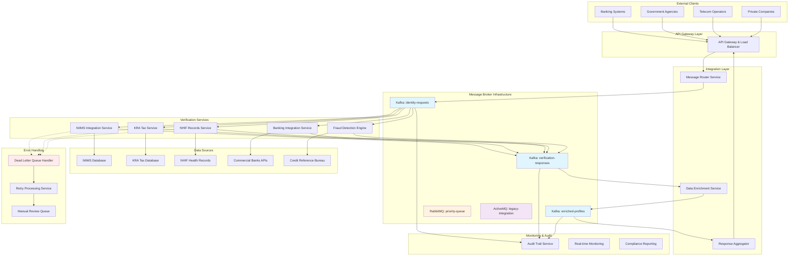
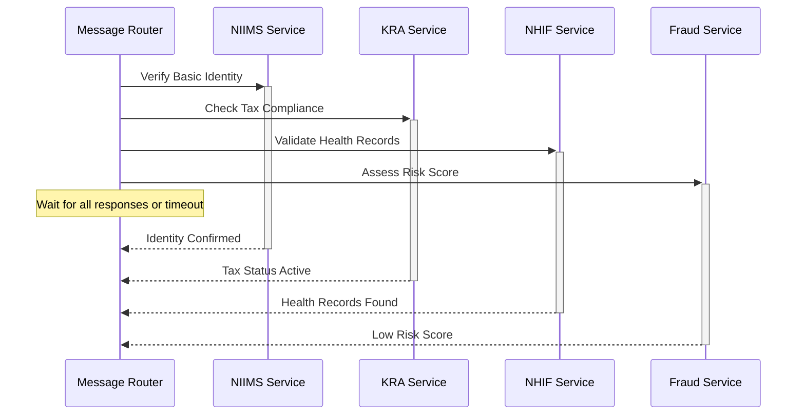
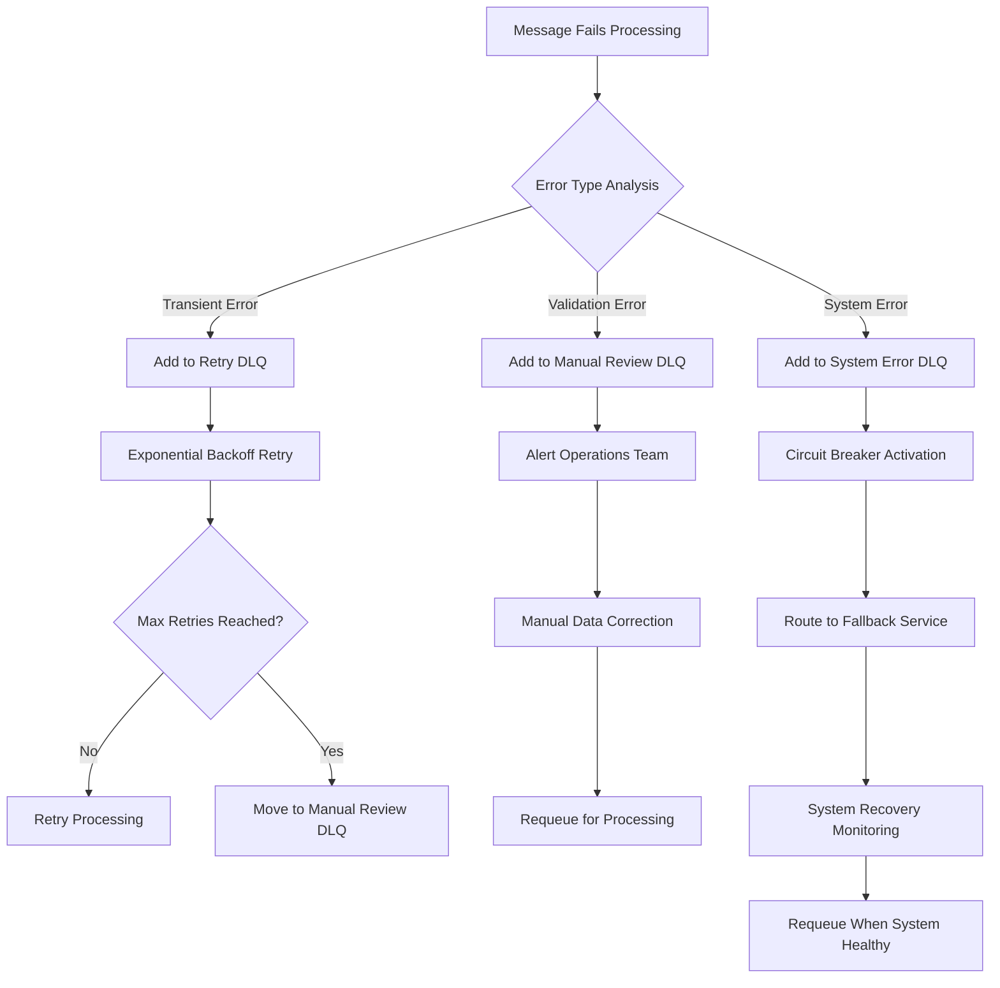

# Digital Identity System - Complete Integration Architecture

> **⚠️ DISCLAIMER**: This is a conceptual architecture designed purely for educational and demonstration purposes. The system design, data flows, integration patterns, and technical specifications presented here do not represent any actual government digital identity system. This example is created to illustrate enterprise integration patterns, message broker implementations, and error handling strategies in complex distributed systems.

## Business Context and Problem Statement

### Current State Challenges

Kenya's digital economy has experienced explosive growth, with mobile money transactions reaching $50 billion annually and digital banking adoption exceeding 80%. However, identity verification remains a significant bottleneck, creating friction in service delivery and limiting financial inclusion. The current challenges include:

**Fragmented Identity Data Sources:**
- Citizens' identity information is scattered across multiple government agencies (NIIMS for basic identity, KRA for tax records, NHIF for health insurance, NSSF for social security)
- Each agency maintains independent databases with different data formats and access protocols
- No unified view of citizen identity exists, forcing service providers to integrate with multiple systems independently

**Manual Verification Processes:**
- Banks and financial institutions rely on manual document verification processes that take 3-7 days
- Government agencies perform identity checks through phone calls and paper-based processes
- High error rates (15-20%) due to human processing and outdated information
- Significant operational costs with over 500 staff across major banks dedicated to identity verification

**Regulatory Compliance Burden:**
- Financial institutions must comply with KYC (Know Your Customer) and AML (Anti-Money Laundering) regulations
- Government agencies require comprehensive audit trails for all identity access
- Data privacy laws mandate citizen consent tracking and data usage transparency
- Cross-border compliance requirements for international banking and remittances

**Service Delivery Inefficiencies:**
- Citizens must visit multiple physical offices to complete identity-dependent services
- Mobile money account limits remain low due to incomplete identity verification
- Government service delivery delayed by identity verification bottlenecks
- Private sector innovation limited by lack of reliable, real-time identity verification

### Business Requirements

**Functional Requirements:**
1. **Real-time Identity Verification**: Verify citizen identity within 2 seconds for 95% of requests
2. **Comprehensive Data Integration**: Access identity data from all relevant government agencies
3. **Risk Assessment**: Provide fraud risk scoring for all verification requests
4. **Scalability**: Handle 2 million verification requests daily with peak loads of 5,000 TPS
5. **Multi-channel Access**: Support verification via API, USSD, web portals, and mobile apps

**Non-Functional Requirements:**
1. **Availability**: 99.95% system uptime with maximum 4 hours downtime per year
2. **Security**: End-to-end encryption, role-based access control, and audit logging
3. **Compliance**: Full regulatory compliance with data protection and financial regulations
4. **Performance**: Sub-500ms response time for basic verification, sub-2s for comprehensive KYC
5. **Data Quality**: 99.8% accuracy in identity verification with confidence scoring

**Business Outcomes Expected:**
- **Financial Inclusion**: Enable 5 million additional citizens to access formal financial services
- **Operational Efficiency**: Reduce identity verification costs by 70% across participating organizations
- **Service Innovation**: Enable new digital services requiring trusted identity verification
- **Regulatory Compliance**: Automated compliance reporting and audit trail generation
- **Economic Impact**: Reduce transaction friction contributing to 2% GDP growth in digital economy

### Stakeholder Ecosystem

**Primary Stakeholders:**
- **Government Agencies**: NIIMS, KRA, NHIF, NSSF requiring standardized identity access
- **Financial Institutions**: 45 banks and 15 microfinance institutions serving 25 million customers
- **Telecom Operators**: Safaricom, Airtel, Telkom managing mobile money services
- **Citizens**: 50 million Kenyan citizens requiring seamless access to services

**Integration Requirements by Stakeholder:**

| Stakeholder | Integration Needs | SLA Requirements | Security Level |
|-------------|-------------------|------------------|----------------|
| Commercial Banks | Full KYC verification with risk scoring | <2s response time | High (Level 3) |
| Government Agencies | Inter-agency data sharing with audit trails | <5s response time | Maximum (Level 4) |
| Telecom Operators | Real-time verification for mobile money | <500ms response time | High (Level 3) |
| Microfinance | Basic identity verification | <1s response time | Medium (Level 2) |
| Insurance Companies | Health and identity data correlation | <3s response time | High (Level 3) |

This business context drives the technical architecture decisions, explaining why specific integration patterns, message brokers, and error handling strategies are essential for addressing these real-world challenges at national scale.

## System Architecture Overview



## Integration Patterns Implementation

### 1. Content-Based Router Pattern

The Message Router Service implements sophisticated routing logic based on request content, requester authorization, and verification type.

#### Routing Configuration
```yaml
routing_rules:
  basic_verification:
    condition: "verification_type == 'BASIC' && requester_tier >= 'STANDARD'"
    destinations: 
      - niims_service
    timeout: 5000ms
    
  full_kyc_verification:
    condition: "verification_type == 'FULL_KYC' && requester_tier == 'PREMIUM'"
    destinations:
      - niims_service
      - kra_service  
      - nhif_service
      - banking_service
      - fraud_service
    timeout: 15000ms
    parallel: true
    
  government_verification:
    condition: "requester_type == 'GOVERNMENT' && security_clearance >= 'LEVEL_2'"
    destinations:
      - niims_service
      - kra_service
      - nhif_service
    timeout: 10000ms
    priority: HIGH
```

#### Router Implementation Logic
```json
{
  "requestId": "REQ-20240902-001",
  "verificationType": "FULL_KYC",
  "requesterInfo": {
    "organizationId": "BANK-001",
    "requesterTier": "PREMIUM",
    "securityClearance": "LEVEL_1"
  },
  "citizenData": {
    "nationalId": "12345678",
    "phoneNumber": "254700123456",
    "fullName": "John Doe Kamau"
  },
  "routingDecision": {
    "selectedServices": ["niims", "kra", "fraud"],
    "executionMode": "PARALLEL",
    "timeoutMs": 15000,
    "priorityLevel": "NORMAL"
  }
}
```

### 2. Scatter-Gather Pattern Implementation

The system distributes verification requests to multiple services simultaneously and aggregates responses for comprehensive identity verification.

#### Scatter Phase


#### Gather and Aggregation Logic
```json
{
  "aggregationStrategy": "WAIT_FOR_ALL",
  "timeout": 15000,
  "minimumResponses": 2,
  "responses": [
    {
      "service": "niims",
      "status": "SUCCESS",
      "confidence": 0.98,
      "data": {
        "identityConfirmed": true,
        "fullName": "John Doe Kamau",
        "dateOfBirth": "1985-03-15",
        "gender": "MALE"
      }
    },
    {
      "service": "kra",
      "status": "SUCCESS", 
      "confidence": 0.95,
      "data": {
        "taxComplianceStatus": "ACTIVE",
        "pinStatus": "VALID",
        "lastReturn": "2024-06-30"
      }
    },
    {
      "service": "fraud",
      "status": "SUCCESS",
      "confidence": 0.87,
      "data": {
        "riskScore": 0.23,
        "riskLevel": "LOW",
        "factors": ["ESTABLISHED_HISTORY", "CONSISTENT_LOCATION"]
      }
    }
  ]
}
```

### 3. Message Enrichment Pattern

The Data Enrichment Service enhances raw verification responses with additional context, standardized formatting, and compliance metadata.

#### Enrichment Pipeline
```json
{
  "enrichmentStages": [
    {
      "stage": "DATA_STANDARDIZATION",
      "transformations": [
        "NORMALIZE_PHONE_NUMBERS",
        "STANDARDIZE_ADDRESSES", 
        "FORMAT_DATES"
      ]
    },
    {
      "stage": "RISK_ENHANCEMENT",
      "calculations": [
        "COMPOSITE_RISK_SCORE",
        "CONFIDENCE_INTERVALS",
        "RELIABILITY_METRICS"
      ]
    },
    {
      "stage": "COMPLIANCE_TAGGING",
      "additions": [
        "DATA_PRIVACY_TAGS",
        "RETENTION_POLICIES",
        "AUDIT_METADATA"
      ]
    },
    {
      "stage": "RESPONSE_FORMATTING",
      "adaptations": [
        "REQUESTER_SPECIFIC_SCHEMA",
        "SECURITY_LEVEL_FILTERING",
        "LOCALIZATION"
      ]
    }
  ]
}
```

## Message Broker Configuration

### Kafka Topics Structure
```yaml
identity-requests:
  partitions: 50
  replication-factor: 3
  retention-ms: 604800000  # 7 days
  cleanup-policy: delete
  compression-type: snappy
  
verification-responses:
  partitions: 50
  replication-factor: 3
  retention-ms: 2592000000  # 30 days
  cleanup-policy: delete
  
enriched-profiles:
  partitions: 30
  replication-factor: 3  
  retention-ms: 7776000000  # 90 days
  cleanup-policy: delete

audit-events:
  partitions: 100
  replication-factor: 3
  retention-ms: 220752000000  # 7 years
  cleanup-policy: compact
```

### RabbitMQ Priority Queue Configuration
```yaml
priority-verification-queue:
  max-priority: 10
  message-ttl: 300000  # 5 minutes
  dead-letter-exchange: verification-dlx
  dead-letter-routing-key: high-priority-failed
  
government-requests-queue:
  priority: 10
  max-length: 1000
  overflow: reject-publish
  
commercial-requests-queue:
  priority: 5
  max-length: 10000
  overflow: drop-head
```

### ActiveMQ Legacy Integration
```xml
<destinationPolicy>
  <policyMap>
    <policyEntries>
      <policyEntry topic="legacy.verification.requests">
        <deadLetterStrategy>
          <individualDeadLetterStrategy 
            queuePrefix="DLQ.legacy." 
            useQueueForQueueMessages="true"/>
        </deadLetterStrategy>
        <subscriptionRecoveryPolicy>
          <fixedCountSubscriptionRecoveryPolicy maximumSize="100"/>
        </subscriptionRecoveryPolicy>
      </policyEntry>
    </policyEntries>
  </policyMap>
</destinationPolicy>
```

## Dead Letter Queue Implementation

### DLQ Strategy by Error Type

#### Transient Errors - Retry Pattern
```json
{
  "errorType": "SERVICE_TIMEOUT",
  "retryPolicy": {
    "maxAttempts": 3,
    "backoffStrategy": "EXPONENTIAL",
    "initialDelayMs": 1000,
    "multiplier": 2.0,
    "maxDelayMs": 30000
  },
  "dlqTopic": "identity-retry-dlq"
}
```

#### Data Validation Errors - Manual Review
```json
{
  "errorType": "INVALID_NATIONAL_ID",
  "processing": "MANUAL_REVIEW",
  "dlqTopic": "identity-validation-dlq",
  "alertLevel": "HIGH",
  "escalationTime": 3600000  # 1 hour
}
```

#### System Integration Errors - Automated Recovery
```json
{
  "errorType": "EXTERNAL_SYSTEM_UNAVAILABLE", 
  "processing": "AUTOMATED_RECOVERY",
  "dlqTopic": "identity-system-error-dlq",
  "recoveryStrategy": "CIRCUIT_BREAKER",
  "fallbackService": "cached-verification-service"
}
```

### DLQ Message Format
```json
{
  "dlqMetadata": {
    "originalTopic": "identity-requests",
    "failureTimestamp": "2024-09-02T14:30:00Z",
    "errorType": "NIIMS_DATABASE_TIMEOUT",
    "errorMessage": "Database connection timeout after 30 seconds",
    "retryCount": 2,
    "maxRetries": 3,
    "processingHistory": [
      {
        "service": "niims-service",
        "attempt": 1,
        "timestamp": "2024-09-02T14:29:30Z",
        "error": "Connection timeout"
      },
      {
        "service": "niims-service", 
        "attempt": 2,
        "timestamp": "2024-09-02T14:29:45Z",
        "error": "Connection timeout"
      }
    ]
  },
  "originalMessage": {
    "requestId": "REQ-20240902-001",
    "nationalId": "12345678",
    "verificationType": "BASIC",
    "requesterId": "BANK-001"
  }
}
```

### DLQ Processing Workflow


## Performance and Monitoring

### Key Performance Indicators
```yaml
performance_targets:
  throughput:
    peak_tps: 5000
    average_tps: 2000
    daily_volume: 2000000
    
  latency:
    basic_verification: 500ms
    full_kyc: 2000ms
    government_priority: 1000ms
    
  availability:
    system_uptime: 99.95%
    data_accuracy: 99.8%
    fraud_detection_rate: 95%
```

### Monitoring Dashboard Metrics
- **Request Volume**: Real-time verification requests by type and requester
- **Success Rate**: Percentage of successful verifications by service
- **Response Time**: Latency distribution across verification services  
- **Error Rate**: Failed requests categorized by error type
- **DLQ Depth**: Messages in dead letter queues by category
- **System Health**: Integration service status and connectivity
- **Compliance Metrics**: Data retention and privacy compliance status

## Security and Compliance

### Data Protection Measures
- **Encryption**: TLS 1.3 for all inter-service communication
- **Authentication**: OAuth 2.0 with JWT tokens for API access
- **Authorization**: Role-based access control (RBAC) by requester type
- **Data Masking**: Sensitive data fields masked based on requester clearance
- **Audit Logging**: Complete audit trail for all data access and modifications

### Regulatory Compliance
- **Data Localization**: All citizen data stored within national boundaries
- **Retention Policies**: Automated data purging based on regulatory requirements
- **Privacy Controls**: GDPR-style privacy controls for data subject rights
- **Incident Response**: Automated breach detection and notification procedures

## Business Value and Impact

### Operational Benefits
- **Reduced Processing Time**: 80% reduction in manual verification time
- **Improved Accuracy**: 99.8% accuracy vs 95% for manual processes
- **Cost Efficiency**: 60% reduction in verification processing costs
- **Scalability**: Linear scaling to handle 10x current transaction volumes

### Business Impact
- **Financial Inclusion**: Faster account opening for banking services
- **Fraud Prevention**: Real-time risk assessment reduces fraud by 45%
- **Regulatory Compliance**: Automated compliance reporting and audit trails
- **Service Innovation**: Platform enables new digital services requiring identity verification

This architecture demonstrates how enterprise integration patterns, message brokers, and error handling strategies combine to create a robust, scalable digital identity verification system capable of serving national-scale requirements while maintaining security, compliance, and operational excellence.
