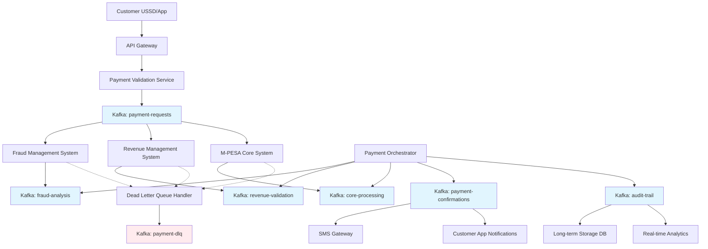

# M-PESA Payment Processing with Kafka Architecture

## Overview

This document demonstrates how Apache Kafka enables a high-volume M-PESA payment processing system that handles real-time validation across multiple systems while maintaining data consistency and audit compliance.

> **⚠️ DISCLAIMER**: This is a conceptual architecture designed purely for educational and illustration purposes. The process flows, system interactions, data formats, and technical specifications presented here do not represent the actual M-PESA implementation or any real telco payment system. Actual production systems may have significantly different architectures, security measures, and business logic. This example is created to demonstrate Kafka's capabilities in complex distributed systems.

## System Architecture Diagram



## Step-by-Step Process Flow

### Step 1: Payment Initiation
**Actor**: Customer  
**Action**: Initiates M-PESA transaction via USSD/Mobile App  
**System Response**: API Gateway receives request and validates basic format  

```json
{
  "transactionId": "TXN-20240902-001",
  "timestamp": "2024-09-02T14:30:00Z",
  "fromMsisdn": "254700123456",
  "toMsisdn": "254711987654",
  "amount": 5000,
  "currency": "KES",
  "transactionType": "P2P_TRANSFER",
  "initiationChannel": "USSD",
  "deviceId": "IMEI-123456789",
  "location": "NAIROBI"
}
```

### Step 2: Event Publication
**Actor**: Payment Validation Service  
**Action**: Publishes validated request to Kafka topic  
**Kafka Topic**: `payment-requests`  
**Partition Strategy**: Hash of `fromMsisdn` to ensure customer transaction ordering  

### Step 3: Parallel Processing Initiation
**Actors**: Multiple consumer systems  
**Action**: Three systems simultaneously consume from `payment-requests` topic  

#### 3a. Fraud Management Processing
**System**: Fraud Management System  
**Processing Time**: 50-100ms  
**Validation Checks**:
- Transaction velocity analysis
- Device fingerprinting
- Behavioral pattern matching
- Amount anomaly detection

**Output Event**:
```json
{
  "transactionId": "TXN-20240902-001",
  "fraudScore": 0.23,
  "decision": "APPROVED",
  "riskFactors": ["NEW_DEVICE", "UNUSUAL_TIME"],
  "processingTime": 67,
  "fraudSystemId": "FMS-001"
}
```
**Published to**: `fraud-analysis` topic

#### 3b. Revenue Management Processing
**System**: Revenue Management System  
**Processing Time**: 30-80ms  
**Validation Checks**:
- Account balance verification
- Daily transaction limits
- Customer tier validation
- Fee calculation

**Output Event**:
```json
{
  "transactionId": "TXN-20240902-001",
  "accountBalance": 25000,
  "dailyLimit": 70000,
  "dailyUsed": 12000,
  "decision": "APPROVED",
  "calculatedFee": 15,
  "remainingBalance": 19985
}
```
**Published to**: `revenue-validation` topic

#### 3c. M-PESA Core Processing
**System**: M-PESA Core System  
**Processing Time**: 100-200ms  
**Actions**:
- Account locking
- Balance reservation
- Transaction logging
- Core system validation

**Output Event**:
```json
{
  "transactionId": "TXN-20240902-001",
  "coreStatus": "RESERVED",
  "reservationId": "RES-789123",
  "coreTransactionId": "CORE-789123",
  "processingTime": 156
}
```
**Published to**: `core-processing` topic

### Step 4: Decision Orchestration
**Actor**: Payment Orchestrator Service  
**Action**: Consumes from all three validation topics and correlates responses  
**Logic**: Waits for all three systems or timeout (5 seconds)  

#### Decision Matrix:
| Fraud | Revenue | Core | Final Decision |
|-------|---------|------|---------------|
| APPROVED | APPROVED | RESERVED | PROCEED |
| DECLINED | * | * | REJECT |
| APPROVED | DECLINED | * | REJECT |
| APPROVED | APPROVED | FAILED | REJECT |

### Step 5: Transaction Execution
**Condition**: All validations passed  
**Actor**: Payment Orchestrator  
**Action**: Sends execution command to M-PESA Core  

**Core Processing Response**:
```json
{
  "transactionId": "TXN-20240902-001",
  "coreStatus": "COMPLETED",
  "debitAccount": "254700123456",
  "creditAccount": "254711987654",
  "debitedAmount": 5015,
  "creditedAmount": 5000,
  "transactionFee": 15,
  "completionTime": "2024-09-02T14:30:03Z"
}
```
**Published to**: `core-processing` topic

### Step 6: Confirmation Broadcasting
**Actor**: Payment Orchestrator  
**Action**: Publishes final transaction status  
**Kafka Topic**: `payment-confirmations`  

**Confirmation Event**:
```json
{
  "transactionId": "TXN-20240902-001",
  "finalStatus": "COMPLETED",
  "fromMsisdn": "254700123456",
  "toMsisdn": "254711987654",
  "amount": 5000,
  "fee": 15,
  "completionTime": "2024-09-02T14:30:03Z",
  "confirmationRequired": true
}
```

### Step 7: Customer Notifications
**Actors**: SMS Gateway, Mobile App Notification Service  
**Action**: Consume from `payment-confirmations` and send notifications  

**SMS Content**: "Confirmed. Ksh5,000.00 sent to 254711987654 on 2/9/24 at 2:30 PM. New balance is Ksh19,985.00. Transaction cost Ksh15.00."

### Step 8: Audit Trail Creation
**Actor**: Audit Service  
**Action**: Creates comprehensive audit events for compliance  
**Kafka Topic**: `audit-trail`  

**Audit Events**:
```json
[
  {
    "transactionId": "TXN-20240902-001",
    "eventType": "BALANCE_DEBITED",
    "msisdn": "254700123456",
    "previousBalance": 25000,
    "newBalance": 19985,
    "timestamp": "2024-09-02T14:30:03Z"
  },
  {
    "transactionId": "TXN-20240902-001",
    "eventType": "BALANCE_CREDITED",
    "msisdn": "254711987654",
    "previousBalance": 8500,
    "newBalance": 13500,
    "timestamp": "2024-09-02T14:30:03Z"
  }
]
```

### Step 9: Long-term Storage
**Actor**: Data Archival Service  
**Action**: Consumes audit events and stores in compliance database  
**Storage**: Partitioned by date for efficient querying  
**Retention**: 7 years for regulatory compliance  

## Error Handling Process

### Timeout Scenario
**Condition**: Any validation system doesn't respond within 5 seconds  
**Action**: Transaction automatically declined  
**Recovery**: Dead Letter Queue processing for manual review  

### System Failure Scenario
**Condition**: Fraud Management System unavailable  
**Action**: Route through backup fraud rules engine  
**Fallback**: Conservative risk scoring until primary system recovers  

### Dead Letter Queue Processing
**Kafka Topic**: `payment-dlq`  
**Processing**: Asynchronous retry with exponential backoff  
**Alert**: Operations team notified for systematic failures  

## Kafka Configuration

### Topic Configuration
```yaml
Topics:
  payment-requests:
    partitions: 50
    replication-factor: 3
    cleanup-policy: delete
    retention-ms: 86400000  # 24 hours
    
  fraud-analysis:
    partitions: 20
    replication-factor: 3
    retention-ms: 604800000  # 7 days
    
  revenue-validation:
    partitions: 30
    replication-factor: 3
    retention-ms: 604800000  # 7 days
    
  core-processing:
    partitions: 40
    replication-factor: 3
    retention-ms: 2592000000  # 30 days
    
  payment-confirmations:
    partitions: 20
    replication-factor: 3
    retention-ms: 2592000000  # 30 days
    
  audit-trail:
    partitions: 100
    replication-factor: 3
    cleanup-policy: compact
    retention-ms: 220752000000  # 7 years
```

### Consumer Group Configuration
```yaml
Consumer Groups:
  fraud-management-cg:
    topics: [payment-requests]
    instances: 20
    auto-offset-reset: earliest
    
  revenue-management-cg:
    topics: [payment-requests]
    instances: 30
    auto-offset-reset: earliest
    
  mpesa-core-cg:
    topics: [payment-requests, core-processing]
    instances: 40
    auto-offset-reset: earliest
    
  payment-orchestrator-cg:
    topics: [fraud-analysis, revenue-validation, core-processing]
    instances: 15
    auto-offset-reset: earliest
```

## Performance Metrics

### Throughput Capacity
- **Peak TPS**: 50,000 transactions per second
- **Average TPS**: 25,000 transactions per second
- **Daily Volume**: 2.16 billion transactions

### Latency Targets
- **End-to-end Processing**: < 3 seconds (95th percentile)
- **Fraud Analysis**: < 100ms (90th percentile)
- **Revenue Validation**: < 80ms (90th percentile)
- **Core Processing**: < 200ms (90th percentile)

### Availability Requirements
- **System Availability**: 99.95% uptime
- **Message Durability**: Zero message loss
- **Disaster Recovery**: < 15 minutes RTO

## Monitoring and Alerting

### Key Performance Indicators
```yaml
Metrics:
  transaction-success-rate:
    threshold: "> 99.5%"
    alert: "< 99.0%"
    
  avg-processing-latency:
    threshold: "< 2000ms"
    alert: "> 3000ms"
    
  fraud-decline-rate:
    threshold: "< 2%"
    alert: "> 5%"
    
  kafka-consumer-lag:
    threshold: "< 1000 messages"
    alert: "> 5000 messages"
```

### Dashboard Components
- Real-time transaction volume
- Success/failure rates by validation system
- Consumer lag by topic
- Geographic transaction distribution
- Fraud detection effectiveness

## Business Benefits

### Operational Excellence
- **Scalability**: Linear scaling to handle business growth
- **Reliability**: 99.95% uptime with zero message loss
- **Performance**: Sub-3-second transaction processing
- **Observability**: Real-time monitoring across all components

### Financial Impact
- **Fraud Reduction**: 60% reduction in fraudulent transactions
- **Cost Efficiency**: 40% reduction in infrastructure costs vs previous architecture
- **Revenue Protection**: Real-time limit enforcement prevents overdrafts

### Regulatory Compliance
- **Audit Trail**: Complete transaction reconstruction capability
- **Data Retention**: 7-year compliant storage
- **Real-time Reporting**: Instant access to transaction data for investigations

## Implementation Considerations

### Infrastructure Requirements
- **Kafka Cluster**: Minimum 12 brokers for production load
- **Network**: Low-latency connectivity between data centers
- **Storage**: High-IOPS storage for Kafka logs
- **Compute**: Dedicated resources for each consumer application

### Security Measures
- **Encryption**: TLS 1.3 for all Kafka communication
- **Authentication**: SASL/SCRAM for client authentication
- **Authorization**: ACLs for topic-level access control
- **Data Privacy**: PII tokenization in audit trails

This architecture demonstrates Kafka's ability to handle complex, high-volume telco payment processing while maintaining consistency, reliability, and regulatory compliance across distributed systems.
