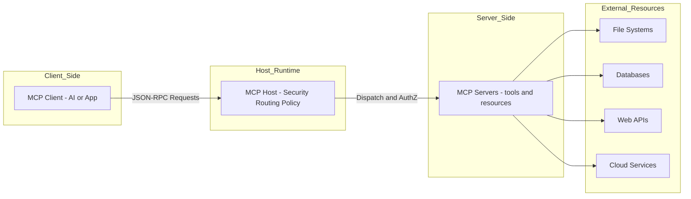
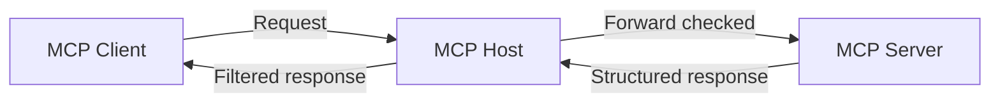
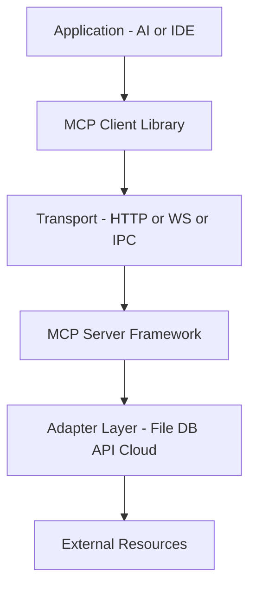
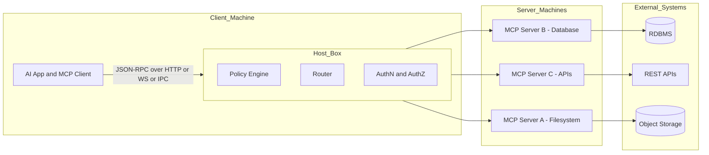
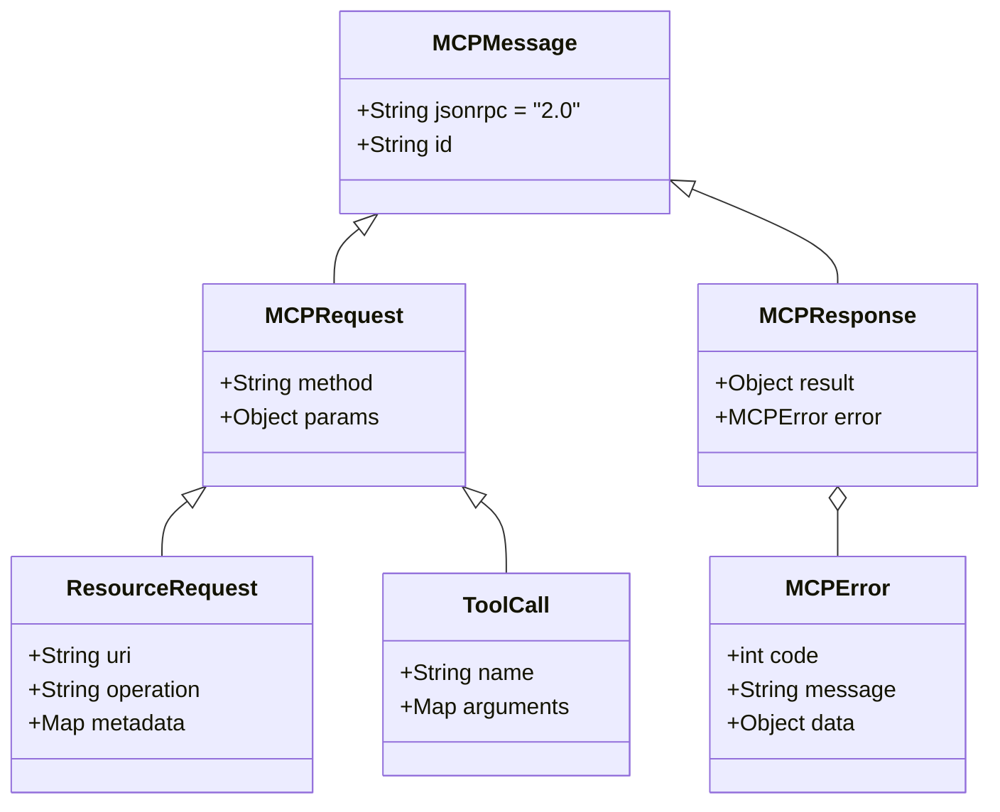
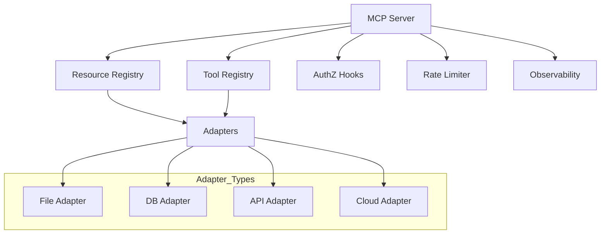
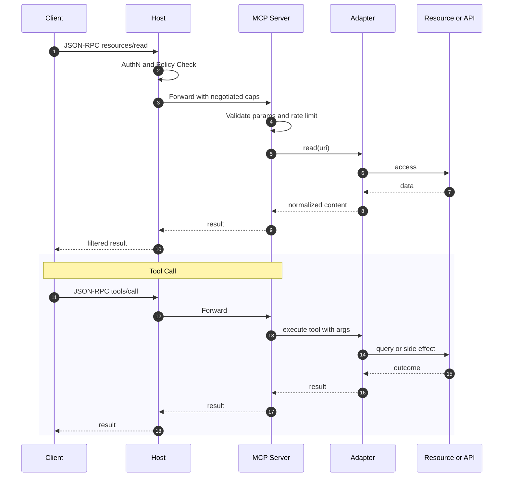
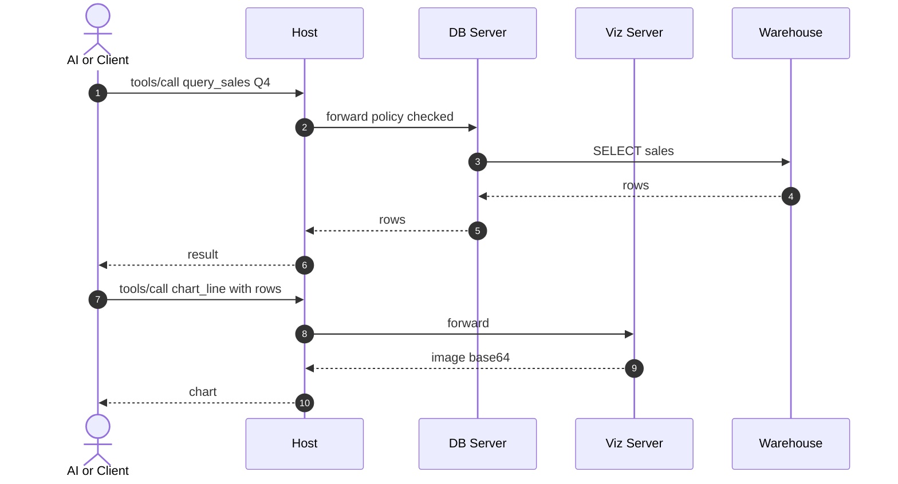
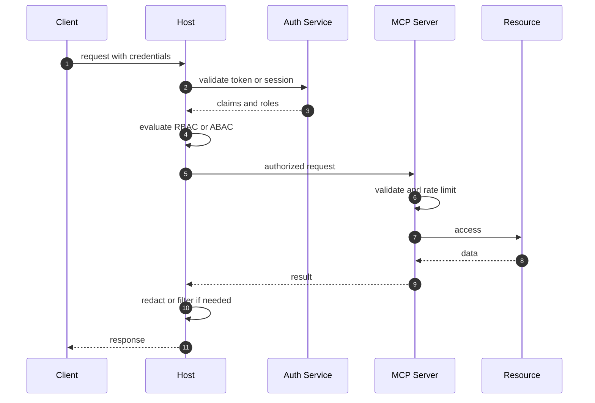
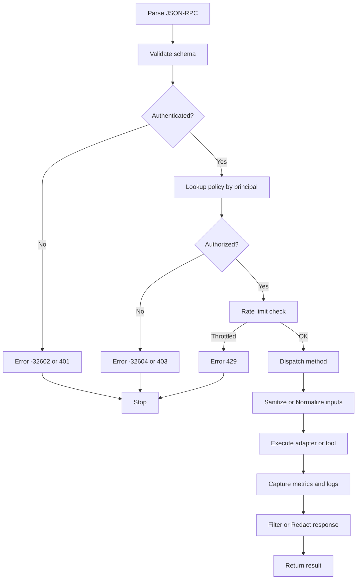

# Model Context Protocol (MCP): A Complete Guide

## Table of Contents

* [Introduction](#introduction)
* [Core Concepts](#core-concepts)
* [Architecture Overview](#architecture-overview)
* [Protocol Components](#protocol-components)
* [Implementation Examples](#implementation-examples)
* [Use Cases & Applications](#use-cases--applications)
* [Security Considerations](#security-considerations)
* [Best Practices](#best-practices)
* [Appendix: Diagram Index](#appendix-diagram-index)
* [Conclusion](#conclusion)


## Introduction

The **Model Context Protocol (MCP)** is a standardized protocol that lets AI models and applications securely interact with external resources—files, databases, web APIs, cloud services—through a consistent, audited, and access-controlled interface. MCP’s goals are:

* **Security**: authenticated, authorized, and sandboxed access.
* **Standardization**: shared message formats and capabilities across resource types.
* **Extensibility**: pluggable servers/tools that expose new capabilities without changing the client.
* **Observability**: logs, metrics, and traces at protocol boundaries.

### High-Level Context (Component View)




## Core Concepts

### The MCP Triangle



### Key Principles

* **Security First**: strong authn/z, sandboxing, least privilege.
* **Stable Interface**: JSON-RPC 2.0, versioned capabilities.
* **Extensibility**: servers expose tools and resources with JSON Schema.
* **Determinism where possible**: predictable outputs for auditing & safety.
* **Observability**: structured logs, metrics, spans.


## Architecture Overview

### Protocol Stack (Layered)



### Deployment View (Isolation & Trust Zones)




## Protocol Components

### Message Model (Class Diagram)



#### Canonical Request (JSON-RPC 2.0)

```json
{
  "jsonrpc": "2.0",
  "id": "req-001",
  "method": "resources/read",
  "params": {
    "uri": "file:///notes/todo.md",
    "mimeType": "text/markdown"
  }
}
```

#### Canonical Response

```json
{
  "jsonrpc": "2.0",
  "id": "req-001",
  "result": {
    "contents": [{
      "uri": "file:///notes/todo.md",
      "mimeType": "text/markdown",
      "text": "# TODO\n- [ ] Ship MCP guide"
    }]
  }
}
```

### Server Capabilities (Component Diagram)



### Request Lifecycle (Sequence)




## Implementation Examples

The code below illustrates interface shapes and safety checks. Adjust to your environment.

### Java (Spring Boot) – Minimal Skeleton

```java
// build.gradle (or pom.xml): add spring-boot-web + jackson

@RestController
@RequestMapping("/mcp")
public class MCPController {

  @PostMapping
  public ResponseEntity<Map<String, Object>> handle(@RequestBody Map<String, Object> req) {
    String method = (String) req.get("method");
    Object id = req.get("id");

    try {
      Map<String, Object> result = switch (method) {
        case "resources/read" -> readResource(req);
        case "resources/list" -> listResources(req);
        case "tools/call"     -> callTool(req);
        case "tools/list"     -> listTools(req);
        default -> throw new IllegalArgumentException("Method not found: " + method);
      };

      return ResponseEntity.ok(Map.of("jsonrpc","2.0","id",id,"result",result));
    } catch (Exception e) {
      Map<String, Object> error = Map.of(
        "code", -32603,
        "message", "Internal error",
        "data", e.getMessage()
      );
      return ResponseEntity.ok(Map.of("jsonrpc","2.0","id",id,"error",error));
    }
  }

  private Map<String, Object> readResource(Map<String, Object> req) throws IOException {
    Map<String, Object> params = (Map<String, Object>) req.get("params");
    String uri = (String) params.get("uri");
    if (!uri.startsWith("file:///")) throw new SecurityException("Only file scheme allowed");
    Path root = Path.of("/safe/root").normalize();
    Path p = Path.of(uri.substring("file://".length())).normalize();
    if (!p.startsWith(root)) throw new SecurityException("Path escapes root");

    String text = Files.readString(p);
    return Map.of("contents", List.of(Map.of("uri", uri, "mimeType", "text/plain", "text", text)));
  }

  private Map<String, Object> listResources(Map<String, Object> req) {
    return Map.of("items", List.of(Map.of("uri","file:///safe/root/","type","directory")));
  }

  private Map<String, Object> listTools(Map<String, Object> req) {
    return Map.of("tools", List.of(
      Map.of("name","search_files","description","Search by glob","parameters", Map.of(
        "type","object",
        "properties", Map.of("pattern", Map.of("type","string"))
      ))
    ));
  }

  private Map<String, Object> callTool(Map<String, Object> req) {
    // demo: echo tool
    Map<String, Object> params = (Map<String, Object>) req.get("params");
    String name = (String) params.get("name");
    Map<String, Object> args = (Map<String, Object>) params.get("arguments");
    return Map.of("tool", name, "echo", args);
  }
}
```

### Python – Tiny HTTP Server Shape

```python
import json
from http.server import BaseHTTPRequestHandler, HTTPServer
from pathlib import Path

ROOT = Path("/safe/root").resolve()

class Handler(BaseHTTPRequestHandler):
    def do_POST(self):
        length = int(self.headers.get("Content-Length", "0"))
        body = self.rfile.read(length)
        req = json.loads(body)
        method = req.get("method")
        _id = req.get("id")

        try:
            if method == "resources/read":
                uri = req["params"]["uri"]
                if not uri.startswith("file:///"):
                    raise ValueError("only file:// supported in demo")
                p = Path(uri[7:]).resolve()
                if ROOT not in p.parents and p != ROOT:
                    raise PermissionError("path escapes root")
                text = p.read_text(encoding="utf-8")
                result = {"contents":[{"uri":uri,"mimeType":"text/plain","text":text}]}
                resp = {"jsonrpc":"2.0","id":_id,"result":result}
            else:
                resp = {"jsonrpc":"2.0","id":_id,"error":{"code":-32601,"message":"Method not found"}}
        except Exception as e:
            resp = {"jsonrpc":"2.0","id":_id,"error":{"code":-32603,"message":"Internal error","data":str(e)}}

        out = json.dumps(resp).encode()
        self.send_response(200)
        self.send_header("Content-Type","application/json")
        self.send_header("Content-Length",str(len(out)))
        self.end_headers()
        self.wfile.write(out)

if __name__ == "__main__":
    HTTPServer(("0.0.0.0", 8765), Handler).serve_forever()
```

### JavaScript – Minimal Client Call Shape

```javascript
async function call(method, params, id = String(Date.now())) {
  const res = await fetch("http://localhost:8765/mcp", {
    method: "POST",
    headers: {"Content-Type":"application/json"},
    body: JSON.stringify({ jsonrpc:"2.0", id, method, params })
  });
  return await res.json();
}

// Example
call("resources/read", { uri: "file:///safe/root/README.md" })
  .then(console.log)
  .catch(console.error);
```


## Use Cases & Applications

### 1) Developer Environments

* IDEs (VS Code, JetBrains) reading and writing files via policy-bound servers.
* Code intelligence tools fetching dependencies, builds, and logs through MCP.

### 2) Data & Analytics

* Query warehouses (Postgres, Snowflake) with strict RBAC and quotas.
* Generate visualizations via a chart tool that returns images or data URIs.

### 3) Content & Knowledge Management

* AI assistants merging content from wikis, docs, and ticketing systems.
* Review and publish workflows with auditable tool calls.

### 4) Enterprise Integrations

* CRM, ERP, and Payments flows behind tools such as `create_invoice` or `post_payment`.
* All calls authenticated, authorized, logged, and rate-limited.

#### Use-Case Flow (Sequence)




## Security Considerations

### AuthN and AuthZ Path (Sequence)



### Threat Model Highlights

* **Input validation**: schema-validate `params` for every method.
* **Path traversal**: normalize and contain file paths to an allow-listed root.
* **Credential handling**: never forward raw secrets; use short-lived tokens.
* **Rate limiting and quotas**: per principal and per tool or resource.
* **Auditability**: structured logs with method, redacted args, duration, and outcome.
* **Network**: TLS, certificate pinning where possible, strict host allow-lists.
* **Isolation**: run each MCP server with least privilege OS or container profiles.

### Policy as Data (Example)

```json
{
  "version": 1,
  "defaultDeny": true,
  "principals": {
    "analyst@company.com": { "roles": ["analyst"] },
    "bot@company.com": { "roles": ["bot"] }
  },
  "roles": {
    "analyst": {
      "allow": [
        {"method":"resources/read","where":{"uriPrefix":"file:///warehouse/"}},
        {"method":"tools/call","where":{"tool":{"in":["query_sales","chart_line"]}}}
      ]
    },
    "bot": {
      "allow": [
        {"method":"resources/list"}
      ]
    }
  },
  "limits": {
    "analyst": { "ratePerMinute": 60, "burst": 120 }
  }
}
```


## Best Practices

### Server Design Pattern (Activity)



### Error Handling (Standardized)

* Use JSON-RPC error codes where applicable:

  * `-32601` Method not found
  * `-32602` Invalid params
  * `-32603` Internal error

* Add `data` with machine-parsable diagnostics (no secrets).

* Prefer idempotent operations for retries (exponential backoff on `TIMEOUT`, `RATE_LIMITED`, `NETWORK_ERROR`).

### Performance

* Connection pooling for DB and API adapters.
* Caching for immutable resources (ETag and If-None-Match).
* Chunked or streaming responses for large payloads.
* Batching: coalesce small calls where semantics permit.

### Observability

* **Metrics**: latency p50 p90 p99, RPS, error rate, auth failures, rate limit events.
* **Tracing**: propagate a correlation or request ID across Host to Server to Adapter.
* **Logging**: structured JSON with method, principal, resource, duration, and status.


## Appendix: Diagram Index

1. High-Level Context (Component View) — Mermaid flowchart
2. The MCP Triangle — Mermaid flowchart
3. MCP Protocol Stack (Layered) — Mermaid flowchart
4. Deployment View (Isolation & Trust Zones) — Mermaid flowchart
5. Message Model (Class Diagram) — Mermaid classDiagram
6. Server Capabilities (Component Diagram) — Mermaid flowchart
7. Request Lifecycle (Sequence) — Mermaid sequenceDiagram
8. Use-Case Flow (Sequence) — Mermaid sequenceDiagram
9. AuthN and AuthZ Path — Mermaid sequenceDiagram
10. Server Request Handling (Activity) — Mermaid flowchart


## Summary

MCP provides a **secure, standardized, and extensible** foundation for AI-to-resource interactions. By separating concerns across **Client, Host, and Server**, and by enforcing **policy, observability, and least-privilege access**, MCP enables teams to safely unlock powerful AI workflows—from IDE assistants and analytics to enterprise integrations—without sacrificing control or trust.
